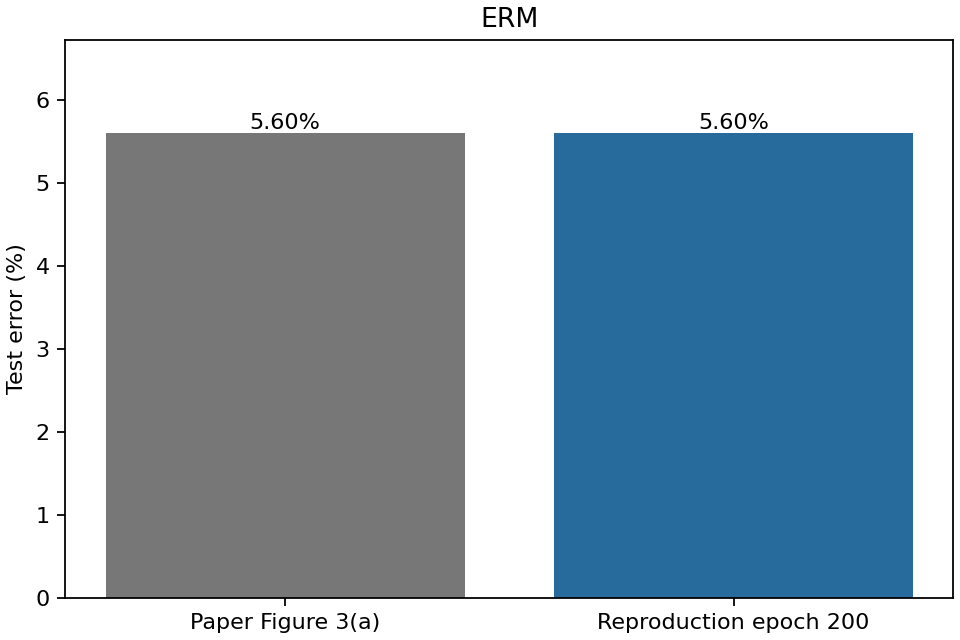
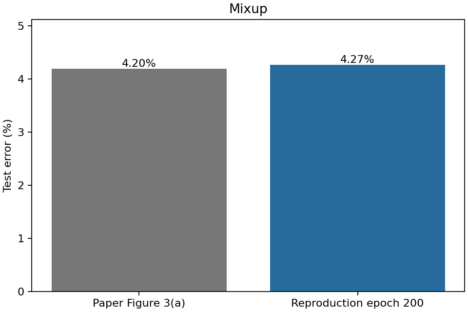
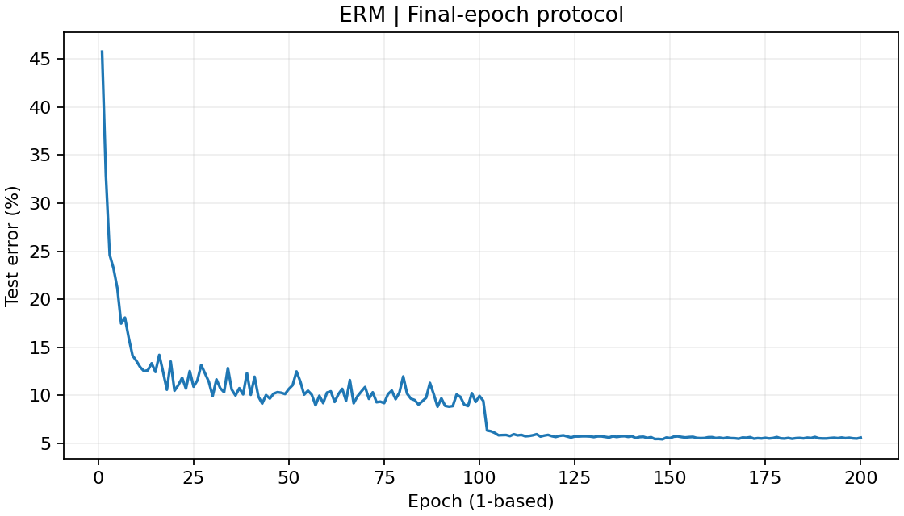
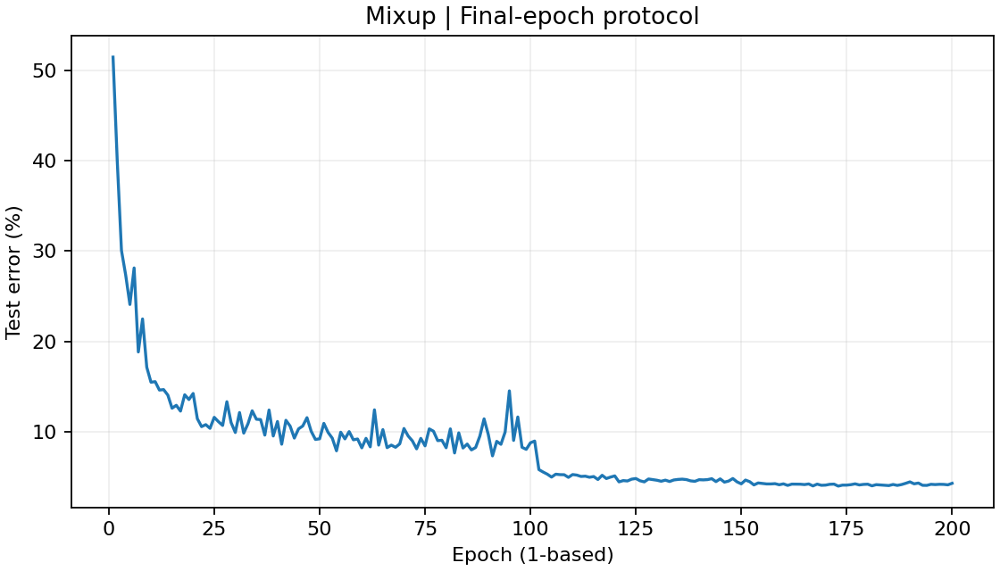

# Mixup: Beyond Empirical Risk Minimization — CIFAR-10 論文復現

《mixup: Beyond Empirical Risk Minimization》（ICLR 2018）提出同時混合訓練輸入與標籤的方法，以改善模型泛化能力。此專案使用 CIFAR-10 與作者官方 PreAct ResNet-18，比較一般 ERM 與 Mixup α=1，各訓練 200 epochs。本次最終 test error 為 ERM **5.60%**、Mixup **4.27%**。這是 CIFAR-10 核心分類實驗的**部分論文復現**，不是整篇論文所有實驗的重製。

## 1. 論文資訊

- **Paper：** mixup: Beyond Empirical Risk Minimization
- **Authors：** Hongyi Zhang, Moustapha Cisse, Yann N. Dauphin, David Lopez-Paz
- **Venue：** ICLR 2018
- **Paper URL：** [arXiv:1710.09412v2](https://arxiv.org/abs/1710.09412v2)
- **Official Code URL：** [facebookresearch/mixup-cifar10](https://github.com/facebookresearch/mixup-cifar10)

## 2. 論文摘要

傳統 ERM 主要要求模型正確預測已見過的訓練樣本，大型神經網路卻可能只記住資料，對未見樣本或微小擾動反應不穩定。Mixup 將兩筆資料的輸入與標籤按相同比例混合，建立虛擬訓練樣本，讓模型學習樣本之間較平順、近似線性的預測關係。作者希望以這種簡單的 regularization 減少過度擬合，改善泛化與穩健性。論文在多項任務觀察到泛化改善，也報告降低錯誤標籤記憶、提升對抗擾動穩健性及穩定 GAN 訓練的效果；本專案只檢驗其中的 CIFAR-10 分類實驗。

以上為原論文摘要與導論的繁體中文整理，並非逐句翻譯。

## 3. 研究目的

ERM 最小化已觀測訓練資料上的平均 loss，但對樣本之間的模型行為缺乏直接限制。容量大的模型因此可能記住 training examples，在其附近形成過度複雜的 decision boundary，並對觀測到的 training distribution 過度擬合；這是論文要處理的風險，不是說每個 ERM 模型都必然如此。

Mixup 希望透過樣本之間的線性插值增加 regularization，鼓勵模型在 training examples 之間呈現較線性的行為，進而改善 generalization 與 robustness。

**本 README 對核心研究問題的整理：**若在輸入與標籤之間建立線性插值的虛擬訓練樣本，是否能降低 ERM 的過度擬合並提升模型泛化能力？這是整理後的問題表述，不是原論文逐字引文。

## 4. 研究方法

### 論文方法：同時混合輸入與標籤

從訓練資料取得兩筆樣本 $(x_i,y_i)$ 與 $(x_j,y_j)$，其中分類標籤以 one-hot 向量表示，使用同一個比例建立 convex combination：

$$
\lambda \sim \mathrm{Beta}(\alpha,\alpha), \qquad \alpha > 0
$$

$$
\tilde{x}=\lambda x_i+(1-\lambda)x_j
$$

$$
\tilde{y}=\lambda y_i+(1-\lambda)y_j
$$

圖片與標籤必須同時混合。例如，70% 貓圖片加上 30% 狗圖片，學習目標也成為 70% 貓、30% 狗，而不是硬指定成其中一類。

α 控制混合比例的分布：較小的正 α 使比例較常靠近 0 或 1，較大的 α 則使比例更集中於 0.5。α 趨近 0 時退化回 ERM；**Beta(0,0) 不是有效分布**，官方程式以 α=0 時直接令 λ=1 來實作一般 ERM。本次 reproduction 的 Mixup 使用 **α=1**，此時 λ 在 0 到 1 之間均勻取樣。

### 作者官方 CIFAR-10 implementation 細節

本專案核對的官方程式使用：

- 同一個 minibatch 內 shuffle，將每張圖片配對到打亂後的圖片，不建立第二個獨立 DataLoader。
- 每個 minibatch 抽取一次 NumPy Beta 的 λ，整批共用。
- 以兩個 cross-entropy 的 λ 加權實作混合標籤 loss：

$$
L=\lambda\,\mathrm{CE}(f(\tilde{x}),y_i)+(1-\lambda)\,\mathrm{CE}(f(\tilde{x}),y_j)
$$

這與對混合的 soft label 計算 cross-entropy 等價。同批 shuffle 也在論文第 2 節討論；每批抽樣的具體程式路徑與兩個 CE 的寫法則由官方程式核對，不將所有實作細節當成論文逐項明定的設定。詳見[來源對照](docs/source_boundary.md)。

## 5. 原論文主要成果

與本 repository 直接相關的是論文第 3.2 節、Figure 3(a) 的 **CIFAR-10 / PreAct ResNet-18** 結果：

| Method | Paper Test Error |
| --- | ---: |
| ERM | 5.60% |
| Mixup α=1 | 4.20% |

Mixup 相較 ERM 降低約 **1.40 percentage points（pp，百分點）**，支持其改善 generalization 的主張。論文還包含其他資料集與任務，但本專案沒有復現那些實驗。Figure 3(a) 未明確交代 final / best 的選取規則，此限制保留於第 9 節。

## 6. 本專案復現範圍

| 有做 | 沒有做 |
| --- | --- |
| CIFAR-10 | ImageNet、CIFAR-100 |
| 作者官方 ResNet18 / PreActBlock implementation | 論文所有 architecture |
| ERM 與 Mixup α=1 | 多種 α sweep |
| 200 epochs、batch size 128 | 多 seed 統計實驗 |
| SGD momentum 0.9、weight decay 1e-4 | adversarial robustness 的完整實驗 |
| 作者官方資料增強與 normalization | calibration 評估（不據此宣稱原論文包含完整 calibration 實驗） |
| epoch 200 final test error、完整 training history | 論文全部表格與 figures |
| checkpoint / resume、final model independent re-evaluation | 其他任務與模型組合的完整重製 |

因此本專案屬於 Mixup 論文 CIFAR-10 核心分類實驗的部分復現，而不是整篇論文的完整重製。

## 7. 本專案復現方法

設定在看到正式結果前已固定；沒有為了接近論文更換 seed、調整 weight decay，或把最佳中途模型當成正式結果。

| 項目 | 本次設定 |
| --- | --- |
| Dataset | 官方 CIFAR-10；50,000 張 train、10,000 張 test |
| Model | 官方 `ResNet18()` / `PreActBlock`；11,171,274 個參數 |
| Epochs | 每組 200 |
| Train / test batch size | 128 / 100 |
| Optimizer | SGD；無 Nesterov |
| Momentum | 0.9 |
| Weight decay | 1e-4 |
| Mixup alpha / ERM alpha | 1 / 0 |
| Seed | 20170922，來自官方 README example，非 paper original seed |
| Paper seed | **UNKNOWN** |
| Precision | FP32 |
| AMP / TF32 | False / False |
| Training augmentation | RandomCrop(32, padding=4)、RandomHorizontalFlip(p=0.5)、ToTensor、Normalize |
| Normalize mean / std | (0.4914, 0.4822, 0.4465) / (0.2023, 0.1994, 0.2010) |
| Test transforms | 只做 ToTensor 與相同 Normalize |
| Dropout / warmup / cosine / label smoothing | 都沒有 |
| Primary metric | **epoch 200 final test error** |

SGD momentum、資料處理及模型內部算子等來自官方 implementation；未公開的歷史環境與 seed 不自行補成作者設定。詳細分類見[論文／官方程式／假設對照](docs/source_boundary.md)。

**LR schedule 採作者官方程式的實際執行語義：**

| Epochs（從 1 起算） | Learning rate |
| --- | ---: |
| 1–101 | 0.1 |
| 102–151 | 0.01 |
| 152–200 | 0.001 |

論文文字寫在 100、150 epochs 後降低，通常解讀為第 101、151 輪開始使用較小 LR；官方程式則用從 0 起算的 epoch，在該輪 train/test 結束後調整，實際從第 **102、152** 輪生效。兩者有 **1 epoch 的 boundary 語義差異**。本專案依預先決定的規則採官方行為，已逐一比對全部 200 輪，沒有隱藏或自行修正邊界。

Epoch 是把全部訓練圖片走過一輪。每輪 50,000 張、batch 128，共 391 批，最後 80 張也保留；每組共 78,200 次參數更新。每輪測試均使用完整 10,000 張、100 批。

## 8. 本專案復現成果

正式比較全部採用 **epoch 200 final test error**。Difference 為本次 reproduction 減去 paper，pp 表示百分點。

| Method | Paper | Reproduction | Difference |
| --- | ---: | ---: | ---: |
| ERM | 5.60% | **5.60%** | 0.00 pp |
| Mixup α=1 | 4.20% | **4.27%** | +0.07 pp |

本次 ERM 與 paper 一致到兩位小數，Mixup 與 paper 相差 +0.07 pp。本次 Mixup 相較 ERM 改善 **1.33 pp**，接近 paper 的約 **1.40 pp**，改善方向相同、幅度相近。

**本次單一固定 seed 實驗成功重現 Mixup 優於 ERM 的核心趨勢，且最終錯誤率與論文報告數值相近。**這不是多 seed 平均，也沒有建立統計顯著性。

既有獨立重新評估紀錄顯示：在同樣的 10,000 張 test images 上，ERM 答對 9,440 張、錯 560 張；Mixup 答對 9,573 張、錯 427 張，錯誤總數少 133 張。這是已完成的模型核對，此次 README 整理沒有重新計算或訓練。

結果來源：[ERM summary](outputs/ERM/summary.json)、[Mixup summary](outputs/Mixup/summary.json)、[獨立評估證據](validation/independent_evaluation.json)、[結果與差異分析](docs/reproduction_results.md)。

### 結果圖






每組資料夾另有 test accuracy 與 training loss 圖。Mixup 使用混合標籤，不宜直接以兩種方法的 train loss 高低判斷優劣；正式比較使用相同 test set 的分類錯誤率。

## 9. 結果討論與限制

1. **Paper seed: UNKNOWN。**本次 20170922 取自官方 README example，並非已確認的論文原始 seed，也沒有依結果挑選 seed。
2. **歷史軟體版本未知。**原始 PyTorch / CUDA / cuDNN 版本未完整公布；本次使用鎖定的現代環境。
3. **BatchNorm initialization 可能不同。**歷史版本與現代版本的 BN gamma 預設曾改變；保留官方模型建構方式仍不足以證明初始化與當年相同。本次採固定 runtime defaults，屬於已揭露的 assumption。
4. **硬體不同。**論文使用 Tesla P100，本次為 RTX 3070 Ti。
5. **DataLoader workers 不同。**官方為 8，本機 Windows 因 WinError1455 改為 0；batch、transforms 不變，但亂數流消耗順序可能改變。
6. **非逐位元確定性。**cuDNN benchmark=True 跟隨官方；保存 RNG 不保證跨程序或硬體 bitwise deterministic。
7. **論文指標選取規則不明。**Figure 3(a) 未清楚指定 final / best；本專案固定 epoch 200 final 為 primary metric，不混用 Table 5 的 last-10-epochs median。
8. **單一 seed。**沒有多 seed 平均、變異估計或統計顯著性的證明，也不保證其他機器或 seed 得到相同數字。
9. **LR boundary 差異。**論文文字與官方程式相差 1 epoch；本次採第 7 節揭露的官方 schedule。

以上都是解釋 reproduction gap 時可考慮的因素，但這份單次實驗**沒有證明哪個因素造成差距**。

| 最佳中途結果（diagnostic only） | Best error | Epoch |
| --- | ---: | ---: |
| ERM | 5.43% | 148 |
| Mixup | 3.96% | 173 |

這些 best 數值僅供診斷，**不納入正式 paper comparison、不替代 final**。原始 JSON 的 `5.599999999999994` 或極接近零的差距來自浮點數儲存；閱讀版按兩位小數顯示，原始資料保留不改。

## 10. Reproducibility / Engineering Details

以下保留本次工程紀錄、失敗資訊與操作入口。兩組正式訓練、checkpoint 核對與獨立重新評估均已完成。`docs/validation_report.md` 記錄的是正式訓練前的 preflight，裡面的「尚未完成」屬於歷史狀態；目前完成狀態請以第 8 節及正式結果證據為準。

### 從哪裡開始看

- **想了解訓練怎麼做、為什麼中斷又能繼續：**[完整白話訓練過程](docs/training_walkthrough_zh.md)。
- **想核對數字與限制：**[結果與差異分析](docs/reproduction_results.md)、[論文／官方程式逐項對照](docs/source_boundary.md)。
- **想看每一輪發生什麼事：**[ERM 200 筆紀錄](outputs/ERM/training_history.csv)、[Mixup 200 筆紀錄](outputs/Mixup/training_history.csv)。
- **想下載完整模型與 checkpoint：**[v1.0.0 完整實驗包](https://github.com/ChenBill900703/mixup-cifar10-reproduction/releases/tag/v1.0.0)。
- **想自行操作：**[下載、驗證與重新訓練說明](docs/reproduce_zh.md)。
- **想快速確認證據：**[結果一致性檢查](validation/final_integrity.json)、[重新載入模型的完整 test-set 評估](validation/independent_evaluation.json)。

### 用什麼電腦跑？

- Windows 11，單張 NVIDIA GeForce RTX 3070 Ti，約 8 GB VRAM。
- 使用者提供的主機規格：Intel i7-11700K、32 GB RAM、SSD。
- 實測 Python 3.12.14、PyTorch 2.7.1+cu126、torchvision 0.22.1+cu126。
- CUDA runtime 12.6、cuDNN 9.7.1、NVIDIA driver 591.86。
- 正式開始前確認 `torch.cuda.is_available() == True`。

Mixup 累計訓練與評估約 **94.8 分鐘**；ERM 約 **98.2 分鐘**。這不包含所有安裝、啟動、寫檔、繪圖與中斷等待時間，不能把這兩個數字當成整個專案的牆鐘時間。

### 有沒有失敗？有，而且沒有刪掉紀錄

1. CUDA 套件下載遇到系統暫存空間不足，改到 E 槽暫存。
2. 初期測試的一個手填參數量預期值寫錯，修正測試，沒有改模型。
3. Windows 8 個資料載入程序載入 cuDNN 時出現 WinError1455，改成 0 workers。batch 128、模型與 transforms 都維持。
4. 正式 ERM 在保存 epoch142 後，下一輪組 batch 時 CPU 配置約 1.5 MiB 記憶體失敗。後來確認 checkpoint 完整，從 epoch143 接續完成200。

這些是可追溯的工程問題。**沒有把失敗當成結果、沒有因為 test error 不理想而換 seed 重跑。** 詳細時間、錯誤與恢復方法在[白話訓練過程](docs/training_walkthrough_zh.md)及[失敗紀錄](docs/setup_failures.md)。

### 為什麼能相信這份結果？

我們做了以下核對，而不是只看一張表：

- 官方模型原檔與使用中的模型檔 SHA-256 相同；forward/backward 比對通過。
- Mixup loss 與 soft-label cross-entropy 的值、梯度一致。
- Quick Test 故意在 epoch1 存檔後停止，再以另一個程序接續 epoch2。
- 每個 epoch 原子寫入模型、optimizer、LR、所有 RNG、DataLoader generator、history 和環境。
- 兩組的完整 CSV 都有連續 200 輪，每輪使用 50,000/10,000 張資料。
- 最終 weights 與 epoch200 checkpoint 的 tensor 逐項一致。
- 重新載入模型，完整評估 10,000 張 test images，得到 ERM 9,440 張正確、Mixup 9,573 張正確，與紀錄吻合。

重新評估沒有訓練，也沒有選新的 checkpoint。模型與紀錄的 SHA-256 可供他人核對。

### 檔案分工

```text
train.py                         正式訓練與安全續跑
config.json                      集中的預設設定；預設 QUICK_TEST=True
models/official_resnet.py         原作者模型原檔
utils/                           資料、checkpoint、報表
tests/                           結構、loss、LR、resume 驗證
outputs/ERM/                     正式 ERM 200 輪紀錄、圖表、summary
outputs/Mixup/                   正式 Mixup 200 輪紀錄、圖表、summary
outputs/quick/                   與正式結果隔離的短測試證據
validation/                     各項檢查與獨立重新評估證據
references/                     論文與固定版本的官方／上游來源
licenses/                       原始授權文字
docs/                           詳細說明、來源對照與失敗紀錄
finalize_results.py              比對兩組完整結果並產生報告
verify_final_evaluation.py       載入最終模型、重新測試全部 10000 張
run_remaining.py                 已授權續跑 ERM 後自動完成結果核對
prepare_new_run.py               建立乾淨的新實驗目錄，保護已發表結果
```

Git 儲存庫保存程式與可直接閱讀的實驗證據。大型 `.pt` 檔放在 [Release 完整實驗包](https://github.com/ChenBill900703/mixup-cifar10-reproduction/releases/tag/v1.0.0)；其中包含兩組 final weights、兩組 resume checkpoint、Quick Test checkpoint，以及同版程式／報表。下載包提供 SHA-256；它不包含 Python 安裝環境、CIFAR-10 原始資料或私人對話。環境可按 requirements 建立，資料由 torchvision 從官方來源下載。

若只按 GitHub 的「Download ZIP」，得到的是原始碼與小型證據，**不含 Release 裡的模型**。要完整保存本次實驗，請下載 Release 的 `mixup-reproduction-complete.zip`。

### 自己再跑一次之前

請先讀[操作說明](docs/reproduce_zh.md)。不要直接在已發表的 `outputs/ERM` 或 `outputs/Mixup` 覆寫新實驗；用 `prepare_new_run.py` 建立新目錄。正式程式保留來源、設定與環境不相容時拒絕 resume 的保護。

### 模型來源與發布版本

官方模型保留自身的 stem BatchNorm/ReLU、PreActBlock 與 shortcut 行為；這不是 torchvision ResNet18，也未用目前上游的另一個 PreActResNet18 取代。本專案直接保留固定 revision 的模型原檔。

本次只整理 README；v1.0.0 Release、既有 manifest 與 SHA-256 保留為原發布版本的紀錄，因此完整實驗包內仍是當時的 README。最新首頁請閱讀 main；這次文件變更不影響模型或實驗證據。

### 論文、來源與授權

- Zhang, Cisse, Dauphin and Lopez-Paz. **mixup: Beyond Empirical Risk Minimization.** ICLR 2018. [arXiv:1710.09412v2](https://arxiv.org/abs/1710.09412v2)。
- [原作者 repository](https://github.com/facebookresearch/mixup-cifar10)，固定 revision `eaff31ab397a90fbc0a4aac71fb5311144b3608b`。
- [原作者引用的上游](https://github.com/kuangliu/pytorch-cifar)，核對 revision `49b7aa97b0c12fe0d4054e670403a16b6b834ddd`；不以目前上游模型取代官方版本。
- 官方 Mixup repository 的 CC BY-NC 4.0 及上游 MIT 文字保留於 [licenses/](licenses/)。這份專案沒有把第三方來源重新宣告成另一種授權；詳見 [來源與發布範圍](docs/publication_scope.md)。

維護者：ChenBill900703。實驗日期：2026-10-06。訓練數值保留原始觀測，不作人工美化。
